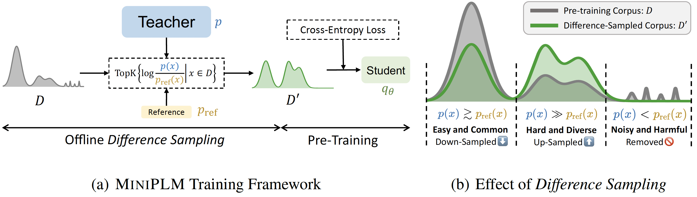

# MiniPLM: Knowledge Distillation of Pre-Training Language Models
[paper]() | [hf](https://huggingface.co/MiniLLM)


</img>

## 1 Setup
```bash
pip3 install -r requirements.txt
```
or
```bash
bash install.sh
```

## 2 Pre-Training Corpus $\mathcal{D}$
We use [the Pile](https://huggingface.co/datasets/monology/pile-uncopyrighted) as our pre-training corpus. Refer to `tools/get_pile.py` to get the data ready. Run the following command for tokenization:
```bash
bash scripts/tools/process_data/pile_qwen.sh /PATH/TO/MiniPLM
```
The processed data is stored in `processed_data/pretrain/pile/qwen-1025`, containing several shards (a pair of `.bin` and `.idx` files). Each shard contains about 1B tokens.


## 3 Models
### 3.1 Teacher Model
We use [QWen1.5-1.8B](https://huggingface.co/Qwen/Qwen1.5-1.8B) as the teacher LM. You can download this model can put it in `checkpoints/qwen/1.8B`.
### 3.2 Reference Model
The [reference model](https://huggingface.co/MiniLLM/MiniPLM-QWen-104M-ref) is a 104M QWen LM trained on 5B tokens randomly split from the Pile, which should be put in `checkpoints/qwen/104M_ref`.
### 3.3 Pre-Trained Models
The [MiniPLM models](https://huggingface.co/collections/MiniLLM/miniplm-6712c0fdf09ef7e8da7d39bd) and [baseline models](https://huggingface.co/collections/MiniLLM/miniplm-baselines-671304a5b6b6ae7167d89000) can be found in the [HuggingFace Hub](https://huggingface.co/MiniLLM).


## 4 Training
### 4.1 MiniPLM
#### Difference Sampling
First, run inference of the teacher LM and the reference LM on the Pile data:
```bash
bash scripts/miniplm/difference_sampling/1.8B.sh /PATH/TO/MiniPLM
bash scripts/miniplm/difference_sampling/104M.sh /PATH/TO/MiniPLM
```
Then, compute the difference scores $r(x,p,p_{\text{ref}})=\frac{\log p(\bm{x})}{\log p_{\text{ref}}(\bm{x})}$:
```bash
python3 scripts/miniplm/difference_sampling/compute_difference_scores.py /PATH/TO/MiniPLM
```
Finally, construct the refined pre-training corpus with the difference scores:
```bash
python3 scripts/miniplm/difference_sampling/construct_pretrain_data.py /PATH/TO/MiniPLM
```
We open-source the [refined data]() (50B tokens) for reproducbility.

#### Pre-Training
```bash
bash scripts/miniplm/pretraining/qwen/200M.sh /PATH/TO/MiniPLM
bash scripts/miniplm/pretraining/qwen/500M.sh /PATH/TO/MiniPLM
bash scripts/miniplm/pretraining/qwen/1.2B.sh /PATH/TO/MiniPLM
```

#### KD Across Model Families
To distill the knowledge of QWen models to Mamba or LLaMA3.1, you just need to convert the QWen tokenization to the target tokenization:
```bash
bash scripts/tools/convert_tokenization/convert_tokenization_qwen_mamba.sh /PATH/TO/MiniPLM
bash scripts/tools/convert_tokenization/convert_tokenization_qwen_llama3_1.sh /PATH/TO/MiniPLM
```

### 4.2 Baselines
#### Conventional Pre-Training
```bash
bash scripts/pretrain/qwen/200M.sh /PATH/TO/MiniPLM
bash scripts/pretrain/qwen/500M.sh /PATH/TO/MiniPLM
bash scripts/pretrain/qwen/1.2B.sh /PATH/TO/MiniPLM
```

#### Vanilla KD
```bash
bash scripts/pretrain/qwen/200M.sh /PATH/TO/MiniPLM
bash scripts/pretrain/qwen/500M.sh /PATH/TO/MiniPLM
bash scripts/pretrain/qwen/1.2B.sh /PATH/TO/MiniPLM
```

#### SeqKD
```bash
bash scripts/pretrain/qwen/200M.sh /PATH/TO/MiniPLM
bash scripts/pretrain/qwen/500M.sh /PATH/TO/MiniPLM
bash scripts/pretrain/qwen/1.2B.sh /PATH/TO/MiniPLM
```

#### MiniLLM
We use the official codebase of [MiniLLM](https://github.com/microsoft/LMOps/tree/main/minillm) for this baseline.


## 5 Evaluation
#### LM-Evaluation-Harness
```bash
bash scripts/eval/harness.sh /PATH/TO/MiniPLM --model-path /PATH/TO/TRAINED_CKPT --ckpt-name NAME_OF_CKPT
```
Note: The `story_cloze` dataset may require manually downloading. Please follow the instructions in this [link](https://huggingface.co/datasets/LSDSem/story_cloze/blob/734b4e1771508f38d8a05f034b48a42986446669/story_cloze.py#L50) to download the test sets. After downloading, you will need to replace the [task configuration file](lm_eval/tasks/storycloze/storycloze_2018.yaml) with [the one](configs/lm_harness_tasks/storycloze_2018.yaml) pointing to the downloaded directory.

#### Language Modeling
```bash
bash scripts/eval/lm.sh /PATH/TO/MiniPLM --model-path /PATH/TO/TRAINED_CKPT --ckpt-name NAME_OF_CKPT
```

## 6 Citation
TODO